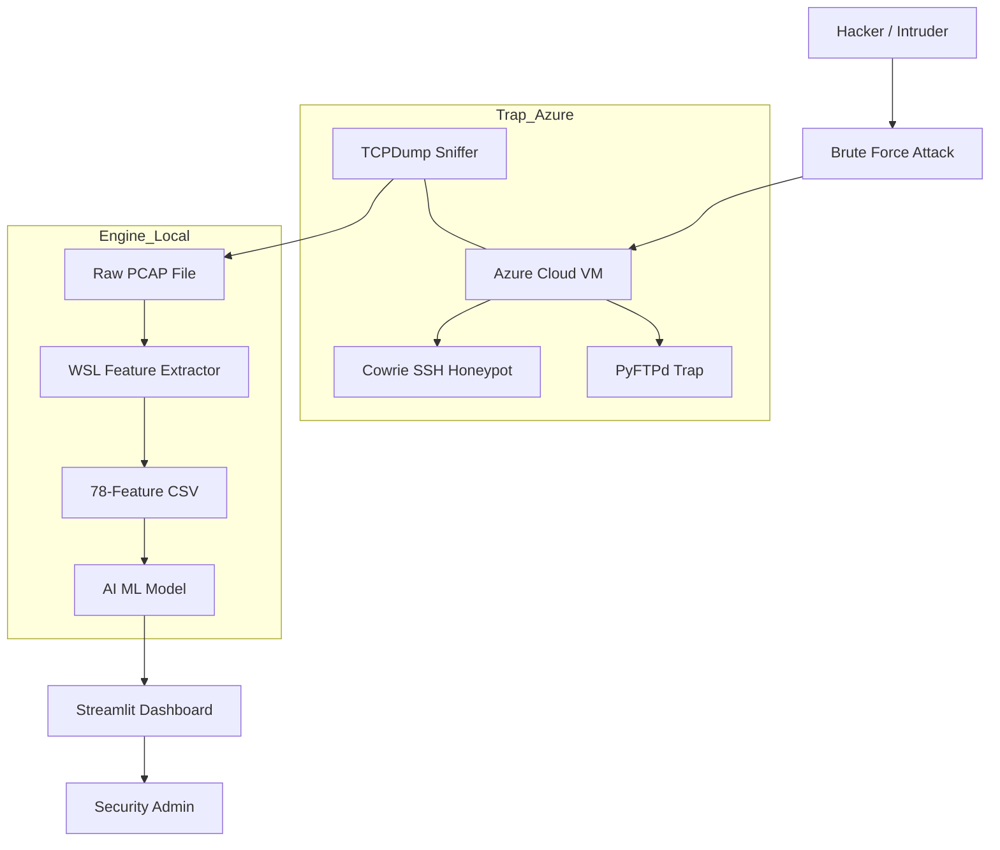

# NEURAL-SHIELD: AI-Driven Intrusion Detection System
## Project Overview & Technical Architecture

### 1. What is this project?
Neural-Shield is a **"Deception-First"** security system. Instead of just blocking hackers, we lure them into a fake environment (a Honeypot) on the cloud, capture their behavior, and use **RandomForest Machine Learning** to identify their attack patterns in real-time.

### 2. What are we building?
We have built a 3-layer security pipeline:
1.  **The Trap (Cloud):** An Azure VM running a Dockerized Honeypot to harvest live hacker traffic.
2.  **The Brain (Inference Engine):** A Machine Learning model trained on the CIC-IDS2017 dataset that analyzes 78 different network features.
3.  **The Eyes (Admin Dashboard):** A professional Streamlit UI that visualizes threat levels and classifies attacks.

---

### 3. System Architecture Diagram

---

### 4. Technical Stack
| Category | Technology Used |
| :--- | :--- |
| **Cloud Provider** | Microsoft Azure (Ubuntu 24.04 LTS) |
| **Honeypot** | Cowrie (Docker), PyFTPdLib |
| **Data Collection** | TCPDump, Scapy |
| **Machine Learning** | Scikit-Learn (RandomForest), Joblib |
| **Feature Extraction** | CICFlowMeter (Running in WSL) |
| **Dashboard** | Streamlit, Plotly, Pandas |

---

### 5. Data Flow (Step-by-Step)
1.  **Capture:** `tcpdump` listens on the Azure network interface for Port 22 (SSH) and Port 21 (FTP).
2.  **Exfiltration:** The raw `.pcap` file is securely downloaded to the local machine via `SCP`.
3.  **Forensics:** `wsl_fix.py` uses Linux-based tools to convert raw packets into 78 statistical features (like flow duration, packet size, inter-arrival time).
4.  **Intelligence:** The AI model processes these 78 features and assigns a probability for each attack type (BENIGN vs SSH-Patator vs FTP-Patator).
5.  **Visualization:** The results are pushed to the **Neural-Shield Dashboard** for human review.

---

### 6. Command Reference & Purpose
| Command | Purpose |
| :--- | :--- |
| `sudo tcpdump ...` | Starts the "Recording" of the network traffic. |
| `ssh ... "exit"` | Simulates a single attack attempt. |
| `scp -P 5555 ...` | Moves the evidence from the Cloud to your Laptop. |
| `python3 wsl_fix.py` | Converts raw network data into "AI-readable" numbers. |
| `streamlit run admin_dashboard.py` | Launches the visual Command Center. |
